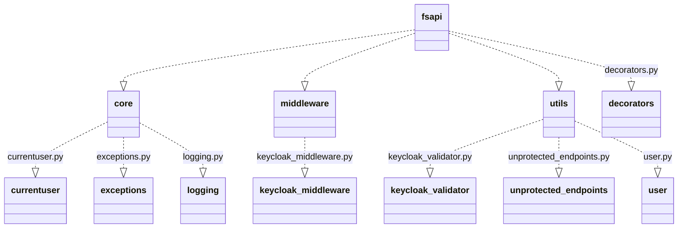

# Overview

The FastSSO - FSAPI module is designed to [enhance FastAPI applications](#overview) with seamless Single Sign-On (SSO) capabilities by leveraging [Keycloak](https://www.keycloak.org/) as the authentication server. The module provides middleware, utility classes, and decorators to facilitate user authentication and authorization. It encapsulates the complexity of interacting with Keycloak and offers an easy-to-use interface for developers to protect their API endpoints with robust security measures.

## Structure

### `core`

Contains essential building blocks of the module, including custom exception handlers and logging setup.

- `currentuser.py`: Functions to retrieve and interact with the current authenticated user's information.
- `exceptions.py`: Custom exception handling functions fostering consistent error responses.
- `logging.py`: Configuration of logging functionality for module-level logging.

### `middleware`

Houses the middleware components integrating Keycloak's authentication mechanism. 

- `keycloak_middleware.py`: A middleware class that ensures incoming requests are authenticated using Keycloak.

### `utils`

Provides utility classes and functions to support authentication tasks.

- `keycloak_validator.py`: Utility class for validating and parsing authentication tokens from Keycloak.
- `unprotected_endpoints.py`: Handles the configuration of unprotected API endpoints which don't require authentication.
- `user.py`: User class representing a user object with its attributes based on the decoded token information.

### `decorators.py`

Includes decorators for additional security controls. Developers can use these decorators to require specific roles, scopes, and other conditions for accessing certain API endpoints.

## Usage

???+ note "Middleware Integration"
    Include the `KeycloakFastSSOMiddleware` in the application. Developers must supply configuration parameters such as Keycloak server URL, realm name, client ID, and secret.

???+ warning "Endpoint Protection"
    Use decorators from `decorators.py` to protect specific routes with role, group, and scope checks, ensuring only authorized users can access them.

???+ tip "User Information Retrieval"
    Access user-specific information within route handlers using functions from `currentuser.py`.

## Exception Handling

Integrate custom exception handlers from `exceptions.py` for unified error responses relating to authentication failures.

## Logging

Use the configured logger from `logging.py` for consistent logging throughout the application.

## Conclusion

The FastSSO - FSAPI module provides a convenient way to integrate SSO into FastAPI applications, abstracting away the intricacies of Keycloak integration and allowing developers to focus on building their API logic with strong security guarantees.
